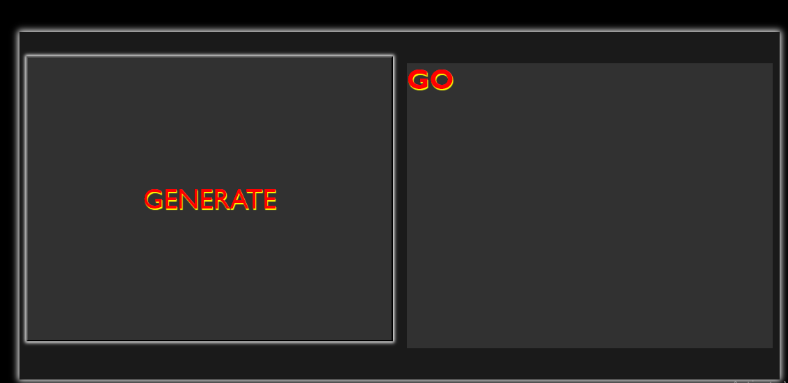
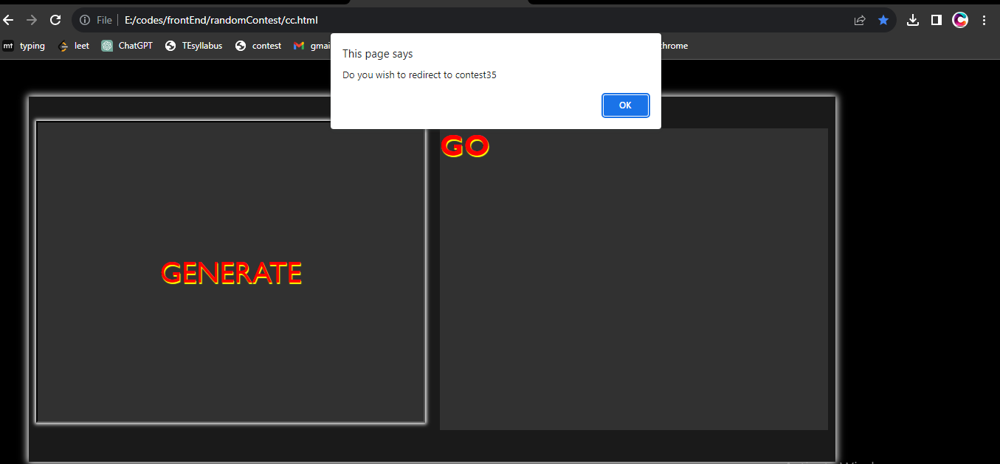

<h1>RANDOM  CODECHEF CONTEST GENERATOR</h1>
 
      <u><b>DOMAIN</b></u> :The project is a pure front end based website
  <u><b>COMPONENTS</b></u> :It has 2 buttons, one is generate and other is go
 <u><b>DESCRIPTION</b></u> :It is used to redirect to the random contest page of codechef 
              <u>The generate button: it randomly selects the number of codechef past contests
              <u>The go button: it redirects to the contest page of the contest with the generated number
 <h3><u><b>USAGE:</b></u></h3>  
1.Download the html and css files.
 2.Open the html with any browser
 3.Click on generate button your website should look like this  
the working photo
 

 4.Click on go button if you wish to visit the contest page of the number shown
